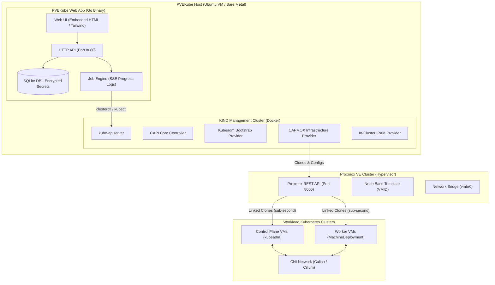
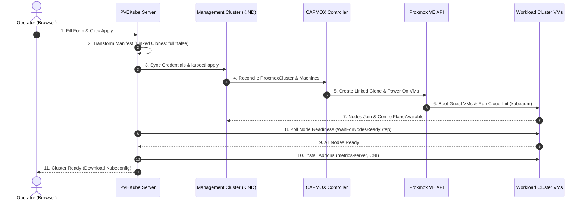

# Architecture

## Overview

PVEKube bridges Proxmox and Kubernetes Cluster API (CAPI) to provide a declarative, GitOps-ready interface for launching production Kubernetes clusters on Proxmox infrastructure.

### Component Architecture Diagram



### Provisioning Sequence Diagram



## Component Roles

### PVEKube Web Server

**Single Go binary** with:
- **HTTP API**: RESTful endpoints for templates, clusters, jobs, status
- **SQLite Database**: Embedded; no external DB needed
  - Schema auto-migrates on startup
  - Secrets encrypted at rest (AES-GCM)
  - Job/Step state persisted for resume-on-restart
- **Job Engine**: Persistent background tasks
  - Runs prerequisite checks, template builds, cluster applies
  - Streams output via SSE (Server-Sent Events) to browser
  - Each job step has a persistent log file
- **UI**: Embedded Tailwind CSS + Font Awesome 4
  - Server-rendered templates
  - htmx for progressive enhancement
  - Real-time CSRF tokens per session

### KIND Management Cluster

**Kubernetes in Docker** running on the PVEKube host:
- Single-node cluster (no HA needed; data is ephemeral)
- Boots via `kind create cluster` with pinned node image
- Hosts the CAPI control plane controllers

### CAPI Providers (Running in KIND)

**Cluster API v1.12.10** + ecosystem:
- **Core (CAPI)**: Cluster, Machine, MachineSet, MachineDeployment abstractions
- **Bootstrap (Kubeadm)**: KubeadmConfig, KubeadmConfigTemplate
- **Control Plane (Kubeadm)**: KubeadmControlPlane high-level abstraction
- **Infrastructure (CAPMOX v0.9.0)**: ProxmoxCluster, ProxmoxMachine, ProxmoxMachineTemplate
- **In-Cluster IPAM (v1.1.0)**: InClusterIPPool for automatic node IP allocation

### Proxmox REST API Client

**Internal HTTP client** in PVEKube:
- Token-based authentication (PVEAPIToken header)
- Normalized URL handling (scheme, port, /api2/json)
- Discovery: queries nodes, bridges, storage pools, disk formats
- Template management: VM cloning, VMID allocation, config queries
- Credentials passed to CAPMOX controller via Secret (capmox-manager-credentials)

### Image Builder (Packer/Ansible)

**Containerized toolkit** (kubernetes-sigs/image-builder v0.1.55):
- Runs inside Docker on the PVEKube host
- Packer provisioner clones a base OS template on Proxmox
- Ansible playbook installs kubeadm + runtime (container runtime, kubelet)
- Goss validates the image
- Result: a Proxmox snapshot with fixed Kubernetes version
- PVEKube stores the snapshot VMID for later cluster launches

## Data Flow: Cluster Launch

### 1. Template Building

```
Browser: Create Template form
  ↓
PVEKube HTTP handler
  ↓
Create Job: cluster.imagebuilder.build
  ↓
Runner: docker run kubernetes-sigs/image-builder
  ├─ env: PROXMOX_URL, PROXMOX_TOKEN, PROXMOX_SECRET
  ├─ env: TEMPLATE_VMID (source), OS_FLAVOR, K8S_VERSION
  └─ runs: packer build + ansible
  ↓
Proxmox: Clone template, install k8s, create snapshot
  ↓
Job completes; VMID stored in SQLite
  ↓
Browser: Sees "Build complete" in live SSE stream
```

### 2. Cluster Design & Validation

```
Browser: Cluster designer form
  ↓
PVEKube handler: parseClusterForm()
  ├─ Validates input (name, replica counts, etc.)
  └─ Loads template details from SQLite
  ↓
IP Plan Validator:
  ├─ Subnet math (gateway, prefix, node range, VIP)
  ├─ Overlap detection (VIP not in node range)
  ├─ Range size check (enough IPs for all nodes)
  └─ Ping probes (gateway, VIP for occupancy)
  ↓
Network status returned to browser
```

### 3. Manifest Generation

```
Browser: Click "Preview Manifest"
  ↓
PVEKube handler: capi.Generate()
  ↓
Runner: clusterctl generate cluster
  ├─ env: PROXMOX_URL, PROXMOX_TOKEN, PROXMOX_SECRET
  ├─ env: TEMPLATE_VMID, NODE_IP_RANGES, CONTROL_PLANE_ENDPOINT_IP
  ├─ args: --infrastructure proxmox, --kubernetes-version, --control-plane-machine-count, --worker-machine-count
  └─ Reads cluster-template.yaml from CAPMOX release
  ↓
Post-Processing Transformations:
  ├─ Replace full: true → full: false (Enforces Linked Clones for sub-second VM creation)
  └─ Strip format: qcow2 (Satisfies CAPMOX validating webhook rules for linked clones)
  ↓
YAML returned to browser; user sees and approves
```

### 4. Cluster Apply & Multi-Stage Readiness Pipeline

```
Browser: Click "Apply — launch this cluster"
  ↓
PVEKube HTTP handler: handleClustersApply()
  ├─ Decrypt Proxmox credentials from SQLite
  └─ Build multi-stage jobs.Spec:
  ↓
Step 1: Sync Proxmox Credentials
  ├─ kubectl apply secret capmox-manager-credentials
  └─ kubectl rollout restart deployment/capmox-controller-manager (if changed)
  ↓
Step 2: Apply Cluster API Manifest
  ├─ kubectl apply -f <manifest> (Cluster, ProxmoxCluster, KubeadmControlPlane, MachineDeployment)
  ↓
Step 3: Wait for Workload Kubeconfig & API Stability
  ├─ Poll for <cluster-name>-kubeconfig Secret in management cluster
  └─ Execute 5 consecutive successful API calls (5s apart) to guarantee API server stability
  ↓
Step 4: Wait for Nodes & CNI Readiness (WaitForNodesReadyStep)
  ├─ Poll workload cluster via kubectl get nodes
  └─ Wait until all expected control-plane and worker nodes report Ready (CNI & cloud-init operational)
  ↓
Step 5+: Install Post-Provisioning Addons
  ├─ Apply metrics-server, Istio, or MetalLB manifests
  └─ Guaranteed zero "dial tcp: no route to host" errors due to earlier readiness gates
  ↓
Job completes; cluster record updated in SQLite
  ↓
Browser: Live SSE streams job progress and step logs
```

### 5. Cluster Reconciliation

```
CAPMOX controller watches ProxmoxCluster + Machine objects
  ↓
For each Machine:
  1. Allocate VMID (via Proxmox API)
  2. Create Linked Clone of template VM (sub-second copy-on-write)
  3. Configure VM (vCPU, memory, network, disk)
  4. Boot VM immediately
  ↓
kubeadm runs on each VM (via cloud-init)
  ├─ Init control plane (first control-plane machine)
  ├─ Join other control planes
  └─ Workers join cluster
  ↓
Cluster API controllers mark conditions as Ready
  ├─ ControlPlaneInitialized
  ├─ ControlPlaneAvailable
  ├─ WorkersAvailable
  ├─ InfrastructureReady
  └─ Available (overall)
  ↓
Browser: Polls /clusters/{name}/status every 5s
  ├─ kubectl get cluster, machines, kubeadmcontrolplane, machinedeployment
  ├─ Parses status.conditions for CAPI v1beta2 compatibility
  └─ When Ready, enables "Download kubeconfig" button
```

### 6. Workload Cluster Access

```
Browser: Click "Download kubeconfig"
  ↓
PVEKube handler: handleClusterKubeconfig()
  ├─ kubectl get secret {cluster-name}-kubeconfig -o jsonpath={.data.value}
  ├─ base64 decode
  └─ return as YAML file
  ↓
User: Use kubeconfig with kubectl/helm/etc. on local machine
  ↓
Kubernetes API server (running on control-plane VMs)
  ├─ Accessible via cluster VIP (control-plane endpoint)
  └─ kubeconfig contains certificates + auth
```

## Storage & Secrets

### SQLite Database

Location: `~/pvekube-data/pvekube.db`

Schema includes:
- `proxmox_connections` — Proxmox host details + encrypted token secret
- `templates` — Built VM templates (OS, K8s version, node, VMID)
- `clusters` — Launched clusters (name, status, manifest YAML, created_at)
- `jobs` — Job history (kind, status, error, output log path)
- `jobs_steps` — Step-level detail (name, status, log line count)

### Encryption

- **Token secrets**: Encrypted with AES-GCM using a cryptographic key derived at first startup
- **Key storage**: Stored in `pvekube-data/security/master.key` (must be backed up securely)
- **Redaction**: Secrets redacted from logs and UI before display

### Logs

Location: `~/pvekube-data/logs/job-{id}-step-{index}.log`

Each job step maintains a line-buffered log file:
- Streamed live to browser via SSE
- Ring buffer (last 10,000 lines in memory) for quick access
- Persisted on disk for historical review

## Networking

### Management Network (PVEKube Host ↔ KIND)

- Docker bridge network (automatic with `kind create cluster`)
- PVEKube connects to KIND API server via localhost:6443
- Bidirectional: PVEKube runs kubectl commands; KIND watches Proxmox resources

### Workload Network (Proxmox VMs ↔ Each Other)

- Configured via cluster designer (gateway, subnet, node IP range)
- CAPMOX configures VM networking (cloud-init)
- In-Cluster IPAM assigns node IPs automatically
- VIP (control-plane endpoint) must be on the same subnet, reachable from PVEKube host
- Optional CNI (Cilium, Calico) for pod-to-pod networking

## Security Model

### Authentication

- **Admin login**: Argon2id password (no external auth; first user sets password in setup)
- **Sessions**: Random token stored in browser cookie
- **CSRF protection**: Per-session token, validated on state-changing requests

### Credential Storage

- **Proxmox token**: Encrypted at rest, never logged
- **Workload kubeconfig**: Stored as a Kubernetes Secret in management cluster (auto-managed by CAPI)

### Network Isolation

- **PVEKube ↔ Proxmox**: Over Proxmox API (HTTPS, token auth)
- **PVEKube ↔ KIND**: localhost only (Docker bridge)
- **PVEKube ↔ Workload Cluster**: Via kubeconfig (user downloads it; PVEKube doesn't proxy)

## Declarative Operations

Everything is expressed as Kubernetes resources:

```yaml
apiVersion: cluster.x-k8s.io/v1beta2
kind: Cluster
metadata:
  name: my-k8s
spec:
  clusterNetwork:
    pods:
      cidrBlocks: ["10.10.10.0/24"]
  controlPlaneRef:
    apiVersion: controlplane.cluster.x-k8s.io/v1beta2
    kind: KubeadmControlPlane
    name: my-k8s-control-plane
---
apiVersion: infrastructure.cluster.x-k8s.io/v1alpha2
kind: ProxmoxCluster
metadata:
  name: my-k8s
spec:
  controlPlaneEndpoint:
    host: 10.10.10.10
    port: 6443
  allowedNodes:
    - node1
    - node2
---
# + ProxmoxMachineTemplate, KubeadmControlPlane, MachineDeployment...
```

PVEKube generates these manifests and applies them via `kubectl apply`. CAPI controllers then reconcile the desired state.

## Extensibility

### Adding a New CNI Plugin

1. Add a new flavor to image-builder's cluster-template (e.g., `cluster-template-calico.yaml`)
2. PVEKube's UI already supports selecting CNI flavors
3. clusterctl generates manifest with the selected flavor
4. Manifest includes ClusterResourceSet for automatic CNI installation

### Adding a New Infrastructure Provider

1. CAPI is pluggable; add a new provider (e.g., vSphere)
2. Update clusterctl initialization in bootstrap.go to include the new provider
3. Update cluster-template selection
4. PVEKube's core logic remains unchanged (provider-agnostic)

### Custom Image Builds

1. Extend image-builder's Packer/Ansible to add your custom tooling
2. PVEKube's template builder orchestrates the build; the template VMID is interchangeable

---

**[← Back to Docs](/)** | **[Next: Features](features/)**
